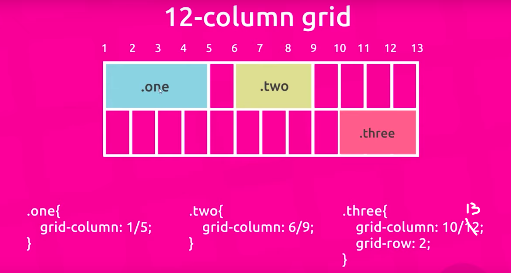

### mobile-first-web

#### learn how to build the mobile first web

---

#### :eyes: demo: [mobile-first-web](https://sincerity628.github.io/mobile-first-web/)

#### :iphone: :computer: Mobile-First Approach
- Design & code websites for mobile first
- Gradually build it up to larger screens / desktops

#### 图片来源声明
- [Planet in top section & footer](https://stock.adobe.com/uk/images/fantasy-cartoon-planet-fantastic-alien-planets-space-world-game-vector-elements-galaxy-space-fantastic-planet-for-gui-illustration/225345787)

- [Square background image](https://stock.adobe.com/uk/images/retro-futuristic-neon-grid-background-80s-design-3d-illustration/298537506)

- [Comet icon images](https://stock.adobe.com/uk/images/comet-asteroid-and-meteorite-cartoon-space-objects-atmospheric-fireballs-vector-set-illustration-of-asteroid-and-comet-meteor-and-meteorite/231710073)

---

#### :writing_hand: 3 ways to use the fonts
- method one :
```css
/* import the font from the website */
@import url('https://fonts.googleapis.com/css?family=Rubik&display=swap');

/* use the font */
body {
  font-family: 'Rubik', sans-serif;
}
```

- method two :
```html
<!-- Link the font in the html template -->
<link href="https://fonts.googleapis.com/css?family=Rubik&display=swap" rel="stylesheet">
```
```css
/* use the font */
body {
  font-family: 'Rubik', sans-serif;
}
```

- method three (can be the custom font) :
```css
/* use the font */
body {
  /* exact the same name in the declare part */
  font-family: 'Rubik Regular', sans-serif;
}

/* font declare */
@font-face {
  /* the name of the font */
  font-family: 'Rubik Regular';
  /* the source of the font file */
  src: url('./assets/fonts/Rubik-Regular.ttf');
}
```

---

#### :writing_hand: about the font size (different devices have different font sizes)
```css
/* initially, the default font size is 16px */
body {
  /* font-size: 16px; */
}
/* em: the value times the default font size */

h1, h3 {
  font-size: 1.2em;
  /* 1.2 * 16px = 19.2px */
}

h2 {
  font-size: 1.6em;
  /* 1.6 * 16px */
}

h4 {
  font-size: 1.1em;
}

.leading {
  font-size: 1.1em;
}

/* for different devices, we just have to change the default font size */
@media screen and (min-width: 620px) {
  body {
    font-size: 16px;
  }
}

@media screen and (min-width: 960px) {
  body {
    font-size: 18px;
    /*
      for examle:
      the <h1> & <h3> now is 1.2 * 18px = 21.6px
    */
  }
}

@media screen and (min-width: 1200px) {
  body {
    font-size: 20px
  }
}
```

---

#### :writing_hand: grid system

